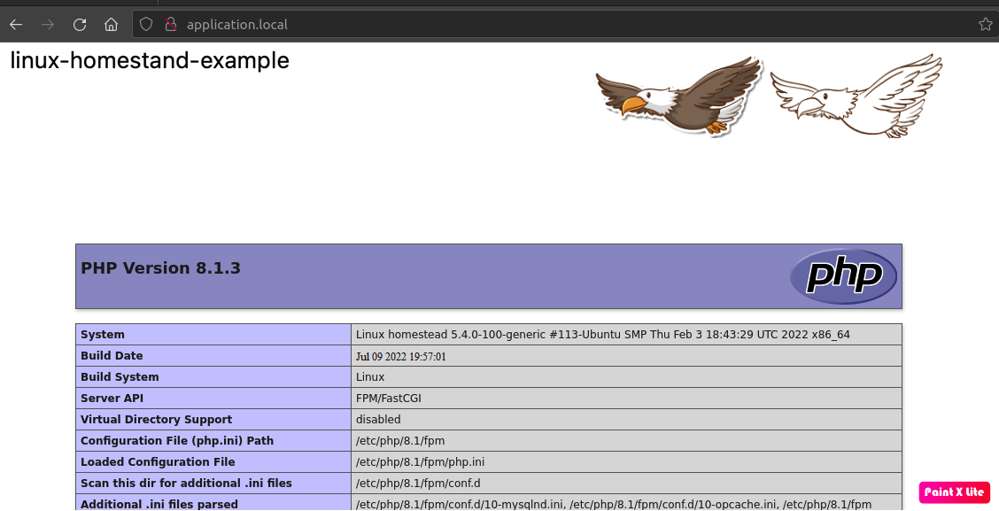

## Площадка для разработки на базе Homestead.

----

### Содержание:
1. [Инструкция по использованию Homestand](./readme/pdf/homestand-info.pdf).

### Детали:
В качестве результата приложен YML-файл для воспроизведения виртуальной машины и скриншот вызова phpinfo через браузер по адресу ***http://application.local***.

#### Скриншот:

LICENSE: [MIT](./readme/license.md)

---

AUTHOR: PoppieHub@GitHub
